## Part 1. Готовый докер

##### Возьми официальный докер-образ с nginx и выкачай его при помощи docker pull.
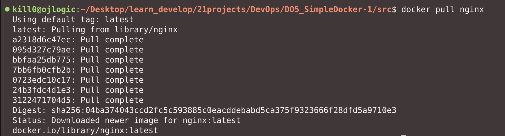
##### Проверь наличие докер-образа через docker images.
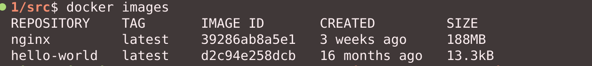
##### Запусти докер-образ через docker run -d [image_id|repository].
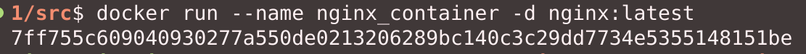
##### Проверь, что образ запустился через docker ps.
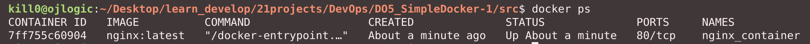
##### Посмотри информацию о контейнере через docker inspect [container_id|container_name].
##### По выводу команды определи и помести в отчёт размер контейнера, список замапленных портов и ip контейнера.
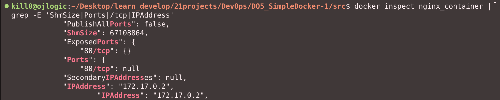
##### Останови докер контейнер через docker stop [container_id|container_name].
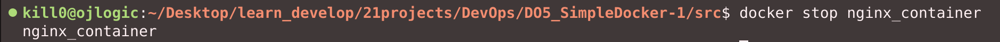
##### Проверь, что контейнер остановился через docker ps.
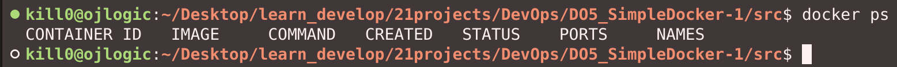
##### Запусти докер с портами 80 и 443 в контейнере, замапленными на такие же порты на локальной машине, через команду run.
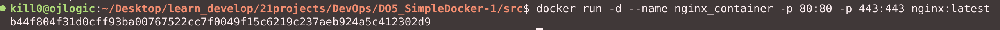
##### Проверь, что в браузере по адресу localhost:80 доступна стартовая страница nginx.
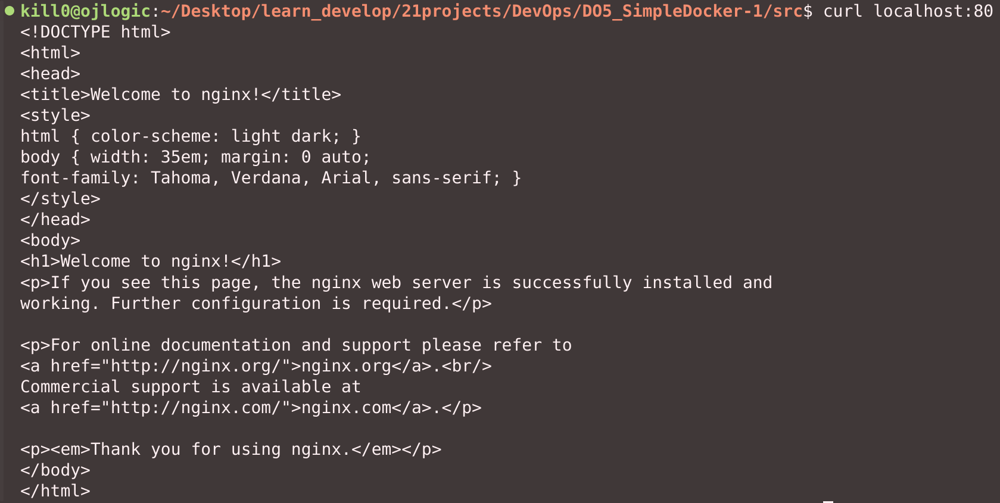
##### Перезапусти докер контейнер через docker restart [container_id|container_name].
##### Проверь любым способом, что контейнер запустился.
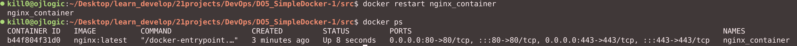


## Part 2. Операции с контейнером


##### Прочитай конфигурационный файл *nginx.conf* внутри докер контейнера через команду *exec*.
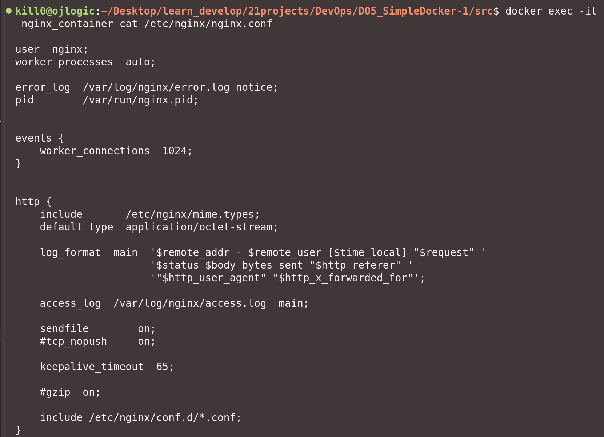
##### Создай на локальной машине файл *nginx.conf*.

##### Настрой в нем по пути */status* отдачу страницы статуса сервера **nginx**.
```
user  nginx;
worker_processes  auto;

error_log  /var/log/nginx/error.log notice;
pid        /var/run/nginx.pid;

events {
    worker_connections  1024;
}

http {
    # server definition
    server {
        listen 80;
        location = /status {
            stub_status on;
        }
    }    
}
```
##### Скопируй созданный файл *nginx.conf* внутрь докер-образа через команду `docker cp`.
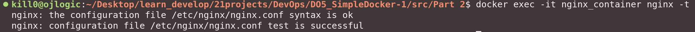
##### Перезапусти **nginx** внутри докер-образа через команду *exec*.
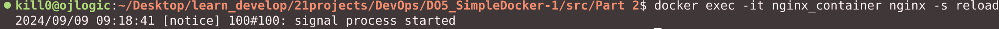
##### Проверь, что по адресу *localhost:80/status* отдается страничка со статусом сервера **nginx**.
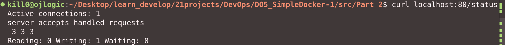
##### Экспортируй контейнер в файл *container.tar* через команду *export*.
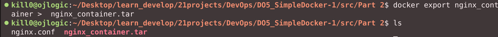
##### Останови контейнер.
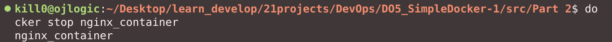
##### Удали образ через `docker rmi [image_id|repository]`, не удаляя перед этим контейнеры.
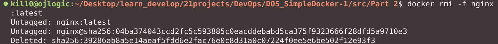
##### Удали остановленный контейнер.
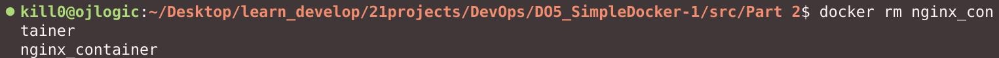
##### Импортируй контейнер обратно через команду *import*.
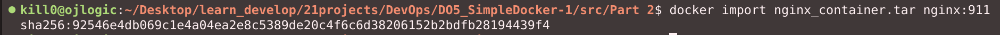
##### Запусти импортированный контейнер.
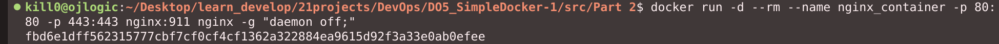
##### Проверь, что по адресу *localhost:80/status* отдается страничка со статусом сервера **nginx**.
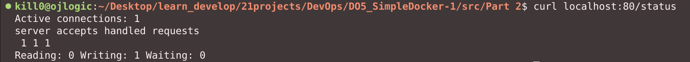

- В отчёт помести скрины:
  - вызова и вывода всех использованных в этой части задания команд;
  - содержимое созданного файла *nginx.conf*;
  - страницы со статусом сервера **nginx** по адресу *localhost:80/status*.

## Part 3. Мини веб-сервер

**== Задание ==**

##### Напиши мини-сервер на **C** и **FastCgi**, который будет возвращать простейшую страничку с надписью `Hello World!`.

```с
#include "fcgi_stdio.h"
#include <stdlib.h>

int main(void) {
    while (FCGI_Accept() >= 0) {
        printf("Content-type: text/html\r\nStatus: 200 OK\r\n\r\nHello World!");
    }
    return 0;
}
```
##### Запусти написанный мини-сервер через *spawn-fcgi* на порту 8080.
##### Напиши свой *nginx.conf*, который будет проксировать все запросы с 81 порта на *127.0.0.1:8080*.

```#!/usr/bin/env bash

docker pull nginx

docker run --rm -d -p 81:81 --name server nginx

docker cp nginx.conf server:/etc/nginx/
docker cp fastcgi_server.c server:/

docker exec server apt-get update
docker exec server apt-get install -y gcc spawn-fcgi libfcgi-dev
docker exec server gcc ./fastcgi_server.c -l fcgi -o fcgi_server
docker exec server spawn-fcgi -p 8080 fcgi_server
docker exec server nginx -s reload
```

##### Проверь, что в браузере по *localhost:81* отдается написанная тобой страничка.
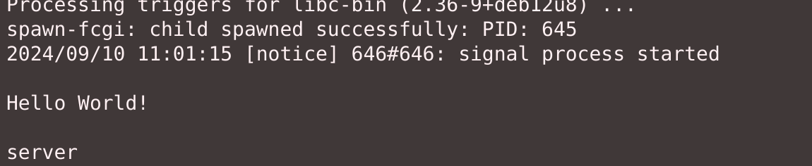
##### Положи файл *nginx.conf* по пути *./nginx/nginx.conf* (это понадобится позже).

## Part 4. Свой докер

### Структура подпроекта
- `Dockerfile` — файл для сборки Docker-образа.
- `fastcgi_server.c` — исходный код FastCGI сервера.
- `inner.sh` — скрипт для запуска сервера и Nginx.
- `nginx/` — директория с конфигурационным файлом Nginx (`nginx.conf`).
- `run.sh` — скрипт для сборки и запуска Docker-образа.

### Dockerfile
```dockerfile
FROM nginx:latest

WORKDIR /app

# Установка необходимых пакетов и сборка FastCGI сервера
RUN apt-get update && apt-get install -y gcc spawn-fcgi libfcgi-dev && \
    gcc ./fastcgi_server.c -l fcgi -o ./fcgi_server

COPY fastcgi_server.c ./
COPY inner.sh ./

EXPOSE 81

ENTRYPOINT ["bash", "./inner.sh"]
```
#### Объяснение
- **FROM nginx:latest**: Используем официальный образ Nginx как базовый.
- **WORKDIR /app**: Устанавливаем рабочую директорию.
- **RUN**: Выполняем обновление пакетов, установку необходимых библиотек и компиляцию сервера за один вызов, чтобы избежать множественных вызовов команд.
- **COPY**: Копируем исходный код и конфигурационный файл внутрь образа.
- **EXPOSE 81**: Открываем порт 81 для Nginx.
- **ENTRYPOINT**: Запускаем скрипт `inner.sh` при старте контейнера.

### Исходный код FastCGI сервера (`fastcgi_server.c`)
```c
#include "fcgi_stdio.h"
#include <stdlib.h>

int main(void) {
    while (FCGI_Accept() >= 0) {
        printf("Content-type: text/html\r\nStatus: 200 OK\r\n\r\nHello World!");
    }
    return 0;
}
```
#### Объяснение
Этот код создает простой FastCGI сервер, который отвечает "Hello World!" на любой запрос.

### Скрипт запуска (`inner.sh`)
```bash
#!/usr/bin/env bash

gcc ./fastcgi_server.c -l fcgi -o ./fcgi_server
spawn-fcgi -p 8080 ./fcgi_server
nginx -g 'daemon off;'
```
#### Объяснение
- **gcc** компилирует исполняемый файл.
- **spawn-fcgi**: Запускает FastCGI сервер на порту 8080.
- **nginx -g 'daemon off;'**: Запускает Nginx в фоновом режиме.

### Конфигурация Nginx (`nginx/nginx.conf`)
```nginx
events {}

http {
    server {
        listen 81;  
        location / {
            fastcgi_pass localhost:8080;  
        }
        location /status {
            stub_status on;
        }
    }
}
```
#### Объяснение
- **listen 81**: Nginx слушает на порту 81.
- **fastcgi_pass localhost:8080**: Проксирование запросов к FastCGI серверу.
- **location /status**: Позволяет получить статус Nginx.

### Сборка и запуск Docker-образа
```bash
# Сборка образа
docker build . -t image_nginx:v4

# Запуск контейнера с маппингом порта и байндмаунтом конфига фига фига
docker run -d --rm -p 80:81 -v $(pwd)/nginx/:/etc/nginx/ --name nginx_container image_nginx:v4

# Проверка работы сервера
sleep 5
curl localhost:80
printf "\n"
curl localhost:80/status

# Остановка контейнера и удаление образа
docker stop nginx_container
docker rmi image_nginx:v4
```
#### Объяснение
- **docker build**: Сборка Docker-образа с тегом `image_nginx:v4`.
- **docker run**: Запуск контейнера с маппингом портов и конфигурационной папкой.
- **curl**: Проверка доступности сервера и статуса Nginx.

### Проверка работоспособности
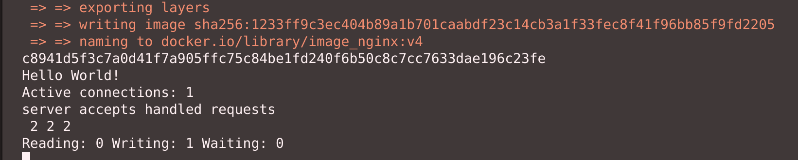

## Part 5. **Dockle**

После написания образа никогда не будет лишним проверить его на безопасность.

**== Задание ==**

##### Просканируй образ из предыдущего задания через `dockle [image_id|repository]`.
##### Исправь образ так, чтобы при проверке через **dockle** не было ошибок и предупреждений.

Короче это очень грустная пратика - чесать отлаженные образы нджинкса 
для быстрого старта.
Код в репозитории. 

### ОНО воркает:
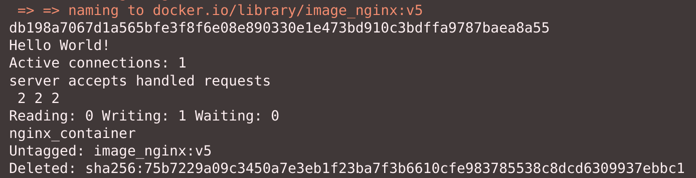

## Part 6. Базовый **Docker Compose**

**== Задание ==**

##### Напиши файл *docker-compose.yml*, с помощью которого:

##### 1) Подними докер-контейнер из [Части 5](#part-5-инструмент-dockle) _(он должен работать в локальной сети, т. е. не нужно использовать инструкцию **EXPOSE** и мапить порты на локальную машину)_.
##### 2) Подними докер-контейнер с **nginx**, который будет проксировать все запросы с 8080 порта на 81 порт первого контейнера.
##### Замапь 8080 порт второго контейнера на 80 порт локальной машины.

##### Останови все запущенные контейнеры.
##### Собери и запусти проект с помощью команд `docker-compose build` и `docker-compose up`.
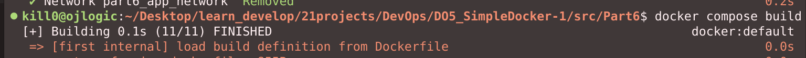
##### Проверь, что в браузере по *localhost:80* отдается написанная тобой страничка, как и ранее.


### Я это сделал, это было круто.
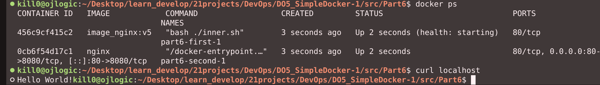